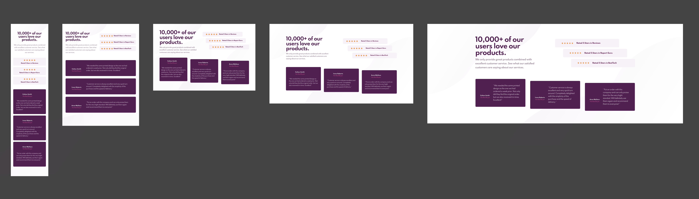

# Frontend Mentor - Social proof section solution - by Pau Ferrer

This is a solution to the [Social proof section challenge on Frontend Mentor](https://www.frontendmentor.io/challenges/social-proof-section-6e0qTv_bA). Frontend Mentor challenges help you improve your coding skills by building realistic projects. 


## Table of contents

- [Overview](#overview)
  - [The challenge](#the-challenge)
  - [Screenshot](#screenshot)
  - [Links](#links)
- [My process](#my-process)
  - [Built with](#built-with)
  - [What I learned](#what-i-learned)
  - [Continued development](#continued-development)
  - [Useful resources](#useful-resources)
- [Author](#author)

## Overview

### The challenge

Users should be able to:

- View the optimal layout for the section depending on their device's screen size

### Screenshot



### Links

- Solution URL: [github repo](https://github.com/PaulOCastle/CHL003_SOCIAL_PROOF_SECTION_MASTER)
- Live Site URL: [vercel live view](https://chl-003-social-proof-section-master.vercel.app/)

## My process

### Built with

- Mobile-first workflow
- Figma design for tablet, laptop & big screens design!!
- Semantic HTML5 markup
- SCSS custom properties
- Flexbox
- Mixins

### What I learned

At the beginning I thought that the challenge was not as complicated as it looked, so I decided, once I've got the 2 designs are given by the free challenge, to design my own tablet, laptop and big screen views. So, I got to practice lots my Figma skills, and I have enjoyed a lot!!!

#### Review cards & its frame html code

I like this code because I think it was a good way to position the cards using flexbox and get the design to work easy.

```html
<div class="review-frame">
  <article class="card card-review">
    <div class="card-header">
      
      <div class="buyer-data">
        <p class="buyer-name">Anne Wallace</p>
        <p class="buyer-verified">Verified Buyer</p>
      </div>
    </div>
    <div class="card-body">
      <p class="content">
        "Put an order with this company and can only praise them for the very high
        standard. Will definitely use them again and recommend them to everyone!"
      </p>
    </div>
  </article>
</div>
```

#### My display flex mixin!!

I do use flexbox a lot, so I decided to create a easy to use mixin. This is the v1.0 and hope to get to improve it on time to get it to be more flexible and to include all the flexbox properties.

I think I will give a go to create a function next time...

```css
@mixin flex ($direction: null, $justify: null, $a-items: null) {
  display: flex;
  @if $direction != null {flex-direction: $direction;}
  @if $justify != null {justify-content: $justify;}
  @if $a-items != null {align-items: $a-items;}
}
```

### Continued development

I would like to keep upskilling on:

- Mobile first approach
- HTML5 semantic coding
- SCSS mixins
- SCSS functions
- Be able to identify the different components of the design to break the code in files that are easy and friendly to read and understand
- Find an arrangement of the SCSS properties that makes sense and is logical - AND STICK TO IT!!!
- Hopefully practise more JS, as this is the main reason I am here...

### Useful resources

- [w3schools](https://www.w3schools.com/) - I have used this site a lot to find out the basics of HTML5 and semantics, CSS properties (beginner and advance), and JS. It is not the most advance site, but it explains the concepts easy and in good increments.
- [google](https://www.google.com) - Other than that I google all my doubts, questions and problems all the time. Just mention the area you want info on (HTML, SASS, CSS, JS, PHP, JAVA, ...) and then the question.
## Author

- Website - Not yet ready but working on it!!
- Frontend Mentor - [@PaulOCastle](https://www.frontendmentor.io/profile/PaulOCastle)
- Github - [PaulOCastle](https://github.com/PaulOCastle)

